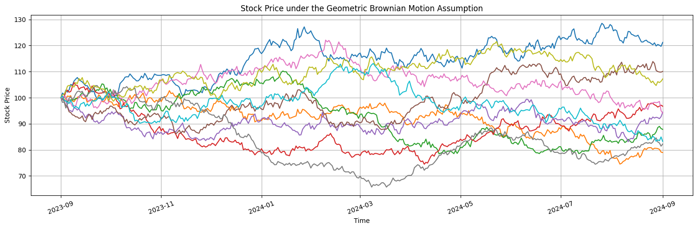
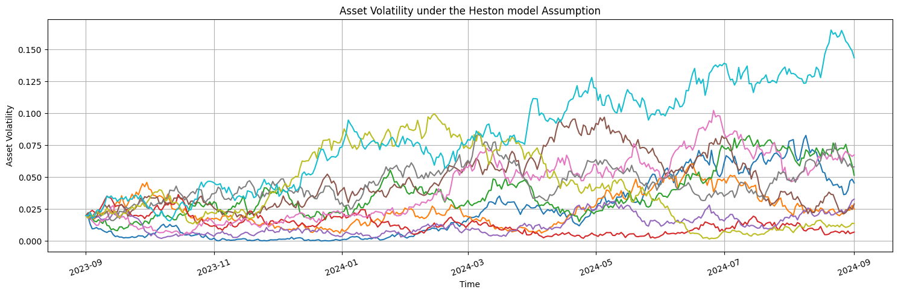

# FinStoch

## Installation

```bash
pip install FinStoch
```

## Processes

### Geometric Brownian Motion

- **SDE**

$$
dS_t = \mu S_t  dt + \sigma S_t dW_t
$$
  
  - A stochastic process where the logarithm of the variable follows a Brownian motion with drift, representing continuous growth with random fluctuations.
  
- **Euler-Maruyama Discretization**

$$
S_{t+\Delta t} = S_t.e^{\left(\mu-\frac{\sigma^2}{2}\right)\Delta t+\sigma\sqrt{\Delta t}\epsilon_t}
$$
  
  Where $\epsilon_t \sim \mathcal{N}(0, 1)$.

```python
import numpy as np
from FinStoch.processes import GeometricBrownianMotion

S0 = 100                    # Initial value 
mu = 0.05                   # Annualized Drift coefficient (expected return rate)
sigma = 0.2                 # Annualized Volatility (standard deviation of returns)
num_paths = 10              # Number of paths to simulate
start_date = '2023-09-01'   # Start date for the simulation
end_date = '2024-09-01'     # End date for the simulation
granularity = 'D'           # Granularity in daily intervals
    
# Create the GBM model
gbm = GeometricBrownianMotion(S0, mu, sigma, num_paths, start_date, end_date, granularity)

# Simulate the GBM process
simulated_paths = gbm.simulate()

# Plot the simulated paths
gbm.plot(paths=simulated_paths, 
         title='Stock Price under Geometric Brownian Motion Assumption', 
         ylabel='Stock Price',
         fig_size=(15,5)
        )
```



### Merton's Jump Diffusion Model

- **SDE**
  
$$
dS_t = \mu S_t  dt + \sigma S_t  dW_t + S_t  dJ_t  
$$
  
  - An extension of the geometric Brownian motion that incorporates sudden, discrete jumps $ J_t $ in addition to continuous diffusion, capturing both regular volatility and occasional large shocks.

- **Euler-Maruyama Discretization**

$$
S_{t+\Delta t} = S_t . e^{\left( \mu - \frac{1}{2} \sigma^2 \right) \Delta t + \sigma \sqrt{\Delta t} \epsilon_t + J_t }
$$

  Where $\epsilon_t \sim \mathcal{N}(0, 1)$ and $J_t$ is the jump component at time $t$.

```python
import numpy as np
from FinStoch.processes import MertonModel

# Parameters
S0 = 100                    # Initial process value
mu = 0.05                   # Drift coefficient
sigma = 0.2                 # Volatility
lambda_j = 1                # Jump intensity
mu_j = 0.02                  # Mean of jump size
sigma_j = 0.1               # Standard deviation of jump size
num_paths = 10              # Number of simulated paths
start_date = '2023-09-01'   # Start date for the simulation
end_date = '2024-09-01'     # End date for the simulation
granularity = 'D'           # Granularity in daily intervals


# Create Merton model instance and plot
merton = MertonModel(S0, mu, sigma, lambda_j, mu_j, sigma_j, num_paths, start_date, end_date, granularity)

# Simulate the Merton process
simulated_paths = merton.simulate()

# Plot the simulated paths
merton.plot(paths=simulated_paths, 
         title='Stock Price under the Merton Model Assumption', 
         ylabel='Stock Price',
         fig_size=(15,5)
        )
```


### Ornstein-Uhlenbeck model

- **SDE**

$$
dS_t = \theta (\mu - S_t)  dt + \sigma dW_t
$$
  - A mean-reverting stochastic process where the variable fluctuates around a long-term mean with a tendency to revert back, driven by continuous noise.

- **Euler-Maruyama Discretization**

$$
S_{t+\Delta t} = S_t + \theta (\mu - S_t) \Delta t + \sigma \sqrt{\Delta t} \epsilon_t
$$

  Where $\epsilon_t \sim \mathcal{N}(0, 1)$.

```python
import numpy as np
from FinStoch.processes import OrnsteinUhlenbeck 

# Parameters
S0 = 100                    # Initial value
mu = 100                    # Annualized drift coefficient
sigma = 0.2                 # Anualized volatility
theta = 0.5                 # Annualized mean reversion rate
num_paths = 10              # Number of paths to simulate
start_date = '2023-09-01'   # Start date for the simulation
end_date = '2024-09-01'     # End date for the simulation
granularity = 'D'           # Granularity in daily intervals

# Create Ornstein-Uhlenbeck model instance and plot
ou = OrnsteinUhlenbeck(S0, mu, sigma, theta, num_paths, start_date, end_date, granularity)

# Simulate the OU process
simulated_paths = ou.simulate()

# Plot the simulated paths
ou.plot(paths=simulated_paths, 
         title='Stock Price under the Ornstein Uhlenbeck model Assumption', 
         ylabel='Stock Price',
         fig_size=(15,5)
        )
```


### Cox-Ingersoll-Ross Model

- **SDE**

$$
dS_t = \kappa (\theta - S_t)  dt + \sigma \sqrt{S_t} dW_t
$$
  - A mean-reverting process with volatility that depends on the current level of the variable, ensuring the values are always non-negative.

- **Euler-Maruyama Discretization**
  
$$
S_{t+\Delta t} = S_t + \kappa (\theta - S_t) \Delta t + \sigma \sqrt{S_t} \sqrt{\Delta t} \epsilon_t
$$

  Where $\epsilon_t \sim \mathcal{N}(0, 1)$.

```python
import numpy as np
from FinStoch.processes import CoxIngersollRoss 

# Parameters 
S0 = 0.03           # Initial value
mu = 0.03           # Long-term mean
sigma = 0.1         # Volatility
theta = 0.03        # Speed of reversion
T = 3.0             # Total time
num_steps = 252     # Number of time steps (e.g., trading days in a year)
num_paths = 10      # Number of simulation paths

# Create the Cox-Ingersoll-Ross model instance and plot
cir = CoxIngersollRoss(S0=S0, mu=mu, sigma=sigma, theta=theta, T=T, num_steps=num_steps, num_paths=num_paths)

# Simulate the CIR process
simulated_paths = cir.simulate()

# Plot the simulated paths
cir.plot(paths=simulated_paths)
```


### Constant Elasticity of Variance Model

- **SDE**

$$
dS_t = \mu S_t  dt + \sigma {S_t}^\gamma dW_t
$$
  
  - A stochastic process that extends the Geometric Brownian Motion process.
  
- **Euler-Maruyama Discretization**

$$
S_{t+\Delta t} = S_t + \mu S_t \Delta t + \sigma {S_t}^\gamma \sqrt{\Delta t} \epsilon_t
$$​

  Where $\epsilon_t \sim \mathcal{N}(0, 1)$.

```python
import numpy as np 
from FinStoch.processes import ConstantElasricityOfVariance

S0 = 100                    # Initial value
mu = 0.05                   # Annualized Drift coefficient (expected return rate)
sigma = 0.2                 # Annualized Volatility (standard deviation of returns)
gamma = 1.2                 # Elasticity coefficient
num_paths = 10              # Number of paths to simulate
start_date = '2023-09-01'   # Start date for the simulation
end_date = '2024-09-01'     # End date for the simulation
granularity = 'D'           # Granularity in daily intervals
    
# Create the CEV model
cev = ConstantElasricityOfVariance(S0, mu, sigma, gamma, num_paths, start_date, end_date, granularity)

# Simulate the CEV process
simulated_paths = cev.simulate()

# Plot the simulated paths
cev.plot(paths=simulated_paths, 
         title='Stock Price under the Constant Elasricity of Variance Model Assumption', 
         ylabel='Stock Price',
         fig_size=(15,5)
        )
```


### Heston Stochastic Volatility Model

- **SDEs**

$$
dS_t = \mu S_t  dt + \sqrt{v_t} S_t  dW_{S,t}
$$

$$
dv_t = \kappa (\theta - v_t)  dt + \sigma_v \sqrt{v_t}  dW_{v,t}
$$

$$
dW_{S,t}\times dW_{v,t}=\rho dt
$$

  - A stochastic volatility model where the volatility of a variable follows its own mean-reverting process, allowing for time-varying volatility that evolves over time.

- **Euler-Maruyama Discretization**

$$
S_{t+\Delta t} = S_t.e^{\left(\mu-\frac{v_t}{2}\right)\Delta t+\sqrt{v_t}\sqrt{\Delta t}\epsilon_{S,t}}
$$

$$
v_{t+\Delta t} = v_t + \kappa (\theta - v_t) \Delta t + \sigma_v \sqrt{v_t} \sqrt{\Delta t} \epsilon_{v,t}
$$

$$
Corr(\epsilon_{S,t},\epsilon_{v,t})=\rho
$$

  Where $\epsilon_S$ and $\epsilon_v$ are correlated standard normal variables.

```python
import numpy as np
from FinStoch.processes import HestonModel

# Parameters
S0 = 100           # Initial value
v0 = 0.02          # Initial volatility
mu = 0.05          # Long-term mean of the value
theta = 0.04       # Long-term mean of the volatility
sigma = 0.3        # Volatility of the volatility
kappa = 1.5        # Speed of reversion
rho = -0.7         # Correlation between shocks
T = 1.0            # Total time
num_steps = 252    # Number of time steps (e.g., trading days in a year)
num_paths = 10     # Number of simulation paths

# Create the Heston model instance and plot
heston = HestonModel(S0, v0, mu, sigma, theta, kappa, rho, T, num_steps, num_paths)

# Simulate the Heston model
simulated_paths = heston.simulate()

# Plot the simulated paths
# Values
heston.plot(paths=simulated_paths)
# Variance
heston.plot(paths=simulated_paths,variance=True)
```




## License
This project is licensed under the MIT license found in the [LICENSE](LICENSE) file.

## Connect with Me

Thank you for visiting my GitHub profile! Feel free to reach out if you have any questions or opportunities to collaborate. Let's connect and explore new possibilities together:

[](https://github.com/Yosri-Ben-Halima)
[](https://www.linkedin.com/in/yosri-ben-halima-3553a9221/)
[](https://www.facebook.com/NottherealYxsry)
[](https://www.instagram.com/yosrybh/)
[](mailto:yosri.benhalima@ept.ucar.tn)
[](https://personal-web-page-yosribenhlima.streamlit.app/)
[](https://drive.google.com/file/d/18xB1tlZUBWz5URSli_9kewEFZwZPz235/view?usp=sharing)
[](https://pypi.org/user/yosri-ben-halima/)