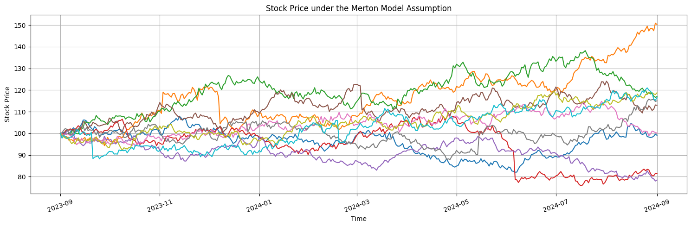
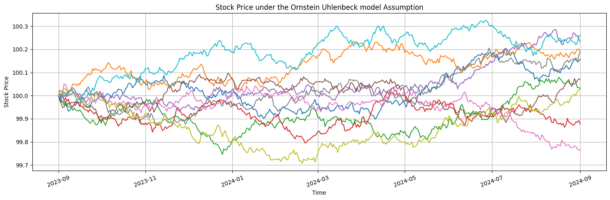
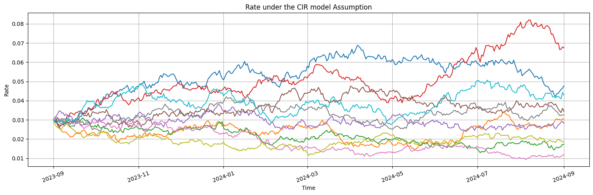

# FinStoch

## Installation

```bash
pip install FinStoch
```

## Installation

```bash
pip install FinStoch
```

## Processes

### Geometric Brownian Motion

- **SDE**

$$
dS_t = \mu S_t  dt + \sigma S_t dW_t
$$
  
  - A stochastic process where the logarithm of the variable follows a Brownian motion with drift, representing continuous growth with random fluctuations.
  
- **Euler-Maruyama Discretization**

$$
S_{t+\Delta t} = S_t.e^{\left(\mu-\frac{\sigma^2}{2}\right)\Delta t+\sigma\sqrt{\Delta t}\epsilon_t}
$$
  
  Where $\epsilon_t \sim \mathcal{N}(0, 1)$.

```python
import numpy as np
from FinStoch.processes import GeometricBrownianMotion

# Parameters
S0 = 100           # Initial value
mu = 0.05          # Drift coefficient
sigma = 0.2        # Volatility
T = 1.0            # Time horizon (1 year)
num_steps = 252    # Number of time steps (252 trading days in a year)              
num_paths = 10     # Number of simulated paths

# Create Geometric Brownian Motion instance and plot
gbm = GeometricBrownianMotion(S0, mu, sigma, T, num_steps, num_paths)

# Simulate the GBM process
simulated_paths = gbm.simulate()

# Plot the simulated paths
gbm.plot(paths=simulated_paths)
```


### Merton's Jump Diffusion Model

- **SDE**
  
$$
dS_t = \mu S_t  dt + \sigma S_t  dW_t + S_t  dJ_t  
$$
  
  - An extension of the geometric Brownian motion that incorporates sudden, discrete jumps $ J_t $ in addition to continuous diffusion, capturing both regular volatility and occasional large shocks.

- **Euler-Maruyama Discretization**
$$
S_{t+\Delta t} = S_t . e^{\left( \mu - \frac{1}{2} \sigma^2 \right) \Delta t + \sigma \sqrt{\Delta t} \epsilon_t + J_t }
$$
  Where $\epsilon_t \sim \mathcal{N}(0, 1)$ and $J_t$ is the jump component at time $t$.

```python
import numpy as np
from FinStoch.processes import MertonModel

# Parameters
S0 = 100          # Initial value
mu = 0.05         # Drift coefficient
sigma = 0.2       # Volatility
T = 1.0           # Time horizon (1 year)
num_steps = 252   # Number of time steps (252 trading days in a year)
num_paths = 10    # Number of simulated paths
lambda_j = 1      # Jump intensity
mu_j = 0.02       # Mean of jump size
sigma_j = 0.1     # Standard deviation of jump size

# Create Merton model instance and plot
merton = MertonModel(S0, mu, sigma, T, num_steps, num_paths, lambda_j, mu_j, sigma_j)

# Simulate the Merton process
simulated_paths = merton.simulate()

# Plot the simulated paths
merton.plot(paths=simulated_paths)
```



### Ornstein-Uhlenbeck model

- **SDE**

$$
dS_t = \theta (\mu - S_t)  dt + \sigma dW_t
$$
  - A mean-reverting stochastic process where the variable fluctuates around a long-term mean with a tendency to revert back, driven by continuous noise.

- **Euler-Maruyama Discretization**

$$
S_{t+\Delta t} = S_t + \theta (\mu - S_t) \Delta t + \sigma \sqrt{\Delta t} \epsilon_t
$$

```python
import numpy as np
from FinStoch.processes import OrnsteinUhlenbeck 

# Parameters
S0 = 100           # Initial value
mu = 0.05          # Drift coefficient
sigma = 0.2        # Volatility
theta = 0.5        # Mean reversion rate
T = 1.0            # Time horizon (1 year)
num_steps = 252    # Number of time steps (252 trading days in a year)              
num_paths = 10     # Number of simulated paths

# Create Ornstein-Uhlenbeck model instance and plot
ou = OrnsteinUhlenbeck(S0, mu, sigma, theta, T, num_steps, num_paths)

# Simulate the OU process
simulated_paths = ou.simulate()

# Plot the simulated paths
ou.plot(paths=simulated_paths)
```



### Cox-Ingersoll-Ross Model

- **SDE**

$$
dS_t = \kappa (\theta - S_t)  dt + \sigma \sqrt{S_t} dW_t
$$
  - A mean-reverting process with volatility that depends on the current level of the variable, ensuring the values are always non-negative.

- **Euler-Maruyama Discretization**
  
$$
S_{t+\Delta t} = S_t + \kappa (\theta - S_t) \Delta t + \sigma \sqrt{S_t} \sqrt{\Delta t} \epsilon_t
$$

```python
import numpy as np
from FinStoch.processes import CoxIngersollRoss 

# Parameters 
S0 = 0.03           # Initial value
mu = 0.03           # Long-term mean
sigma = 0.1         # Volatility
theta = 0.03        # Speed of reversion
T = 3.0             # Total time
num_steps = 252     # Number of time steps (e.g., trading days in a year)
num_paths = 10      # Number of simulation paths

# Create an instance of the CoxIngersollRoss class
cir = CoxIngersollRoss(S0=S0, mu=mu, sigma=sigma, theta=theta, T=T, num_steps=num_steps, num_paths=num_paths)

# Simulate the CIR process
simulated_paths = cir.simulate()

# Plot the simulated paths
cir.plot(paths=simulated_paths)
```



### Heston Stochastic Volatility Model

- **SDEs**

$$
dS_t = \mu S_t  dt + \sqrt{v_t} S_t  dW_1
$$

$$
dv_t = \kappa (\theta - v_t)  dt + \sigma_v \sqrt{v_t}  dW_2
$$

  - A stochastic volatility model where the volatility of a variable follows its own mean-reverting process, allowing for time-varying volatility that evolves over time.

- **Euler-Maruyama Discretization**
  $$
  S_{t+\Delta t} = S_t + \mu S_t \Delta t + \sqrt{v_t} S_t \sqrt{\Delta t} \epsilon_1
  $$
  $$
  v_{t+\Delta t} = v_t + \kappa (\theta - v_t) \Delta t + \sigma_v \sqrt{v_t} \sqrt{\Delta t} \epsilon_2
  $$
  Where $ \epsilon_1 $ and $ \epsilon_2 $ are correlated standard normal variables.
